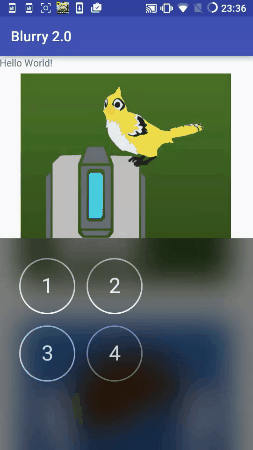

Blurry 2.0
===================

The Project with custom views using the real-time library [[here]] that looks like IOS UIVisualEffectView.

----------

Change Log
-------------

> - 1.0.0 : Initialize real-time blur library.
> - 1.0.1 : Added RingBlurView.
> 

  [here]: https://github.com/mmin18/RealtimeBlurView